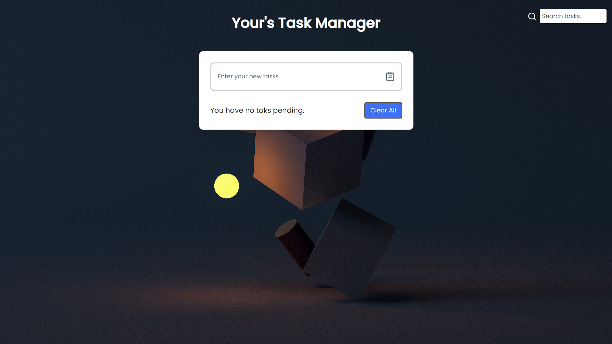

# To-Do

# Task Manager App

## Description

The Task Manager App is a simple web application that allows you to manage your tasks and to-do lists effectively. It provides a user-friendly interface for adding, checking/unchecking, and deleting tasks. The app also features a search functionality that helps you quickly find specific tasks.

You can access the live demo of the app [here](https://ankit-to-do.netlify.app/).

## Features

- Add new tasks by entering them in the input field and pressing Enter.
- Mark tasks as completed by checking the checkbox next to each task.
- Delete tasks using the trash bin icon.
- Search for tasks using the search bar to easily locate specific tasks.
- Responsive design that works well on various devices.

## Technologies Used

- HTML
- CSS
- JavaScript

## How to Use

1. Visit the live demo of the app: [Task Manager App](https://ankit-to-do.netlify.app/).
2. To add a new task, type the task description in the input field and press Enter.
3. To mark a task as completed, click the checkbox next to the task.
4. To delete a task, click the trash bin icon next to the task.
5. To search for tasks, type keywords in the search bar to filter tasks.

## Contributing

Contributions are welcome! If you find any issues or have suggestions for improvements, feel free to open an issue or submit a pull request.

Feel free to customize this template to include additional information or sections that are relevant to your project. You can also add badges, installation instructions, and more, based on your preferences. Make sure to include proper attribution for any images or assets you use in your README. Good luck with your Task Manager app, and if you have any questions or need further assistance, don't hesitate to ask!
